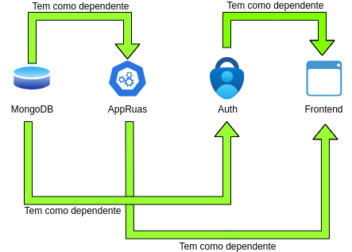

# Trabalho Prático de Engenharia Web

## Mapa das Ruas de Braga - proposta 3

### Autores
Gonçalo Araujo Brandão - a100663

Maya Gomes - a100822

Henrique Morais Pereira - a100831

## Introdução
Este relatório aborda o desenvolvimento de uma plataforma online multifuncional, projetada para facilitar a gestão, administração e disseminação de dados. A proposta exige que a plataforma seja construída sobre um conjunto robusto de funcionalidades, incluindo autenticação de utilizadores, capacidade de exportar e importar informações, entre outras.

A plataforma deverá o upload de pacotes de dados, realizar validações necessárias e, se tudo estiver correto, armazenar o recurso na plataforma, tornando-o disponível para os utilizadores. Caso ocorram erros de validação, um relatório de erros é enviado ao remetente.

O tema específico escolhido pelo grupo é o desenvolvimento da interface para o Mapa das Ruas de Braga, a partir de um dataset que é composto por informações detalhadas de cada uma das ruas, imagens históricas e contemporâneas.

Os objetivos passam então por analisar e tratar o dataset, criar uma interface web de navegação, permitir a adição de novos registos, e permitir a navegação e edição de informações.

Em relação aos utilizadores, o sistema deverá estar protegido com autenticação e existirão diferentes níveis de acesso. Deverão ser também guardados dados relevantes sobre o utilizador.

## Criação do dataset

O material fornecido pela equipa docente era composto por 60 Ficheiros XML com a informação de cada uma das ruas, e diversas imagens das ruas de Braga. Desta forma,
realizamos um sript em python de forma a extrair a informação dos ficheiros XML e a criar um dataset em formato *json*. O script foi desenvolvido de forma a recolher a informação das
ruas e a criar um dataset com a seguinte estrutura:

```json
[
    {
        "nome": "Nome da Rua",
        "rua": "Número/id da Rua",
        "figuras": {
            "id": "ID da Figura",
            "imagem": "Caminho da Imagem",
            "legenda": "Legenda da Imagem"
        },
        "descrições": "Descrição da Rua",
        "casas": [
            {
                "número": "Número da Casa",
                "enfiteutas": [
                    "Enfiteutas da Casa"
                ],
                "foro": "Foro da Casa",
                "desc": [
                    "Descrição da Casa"
                ],
                "vista": "Vista da Casa"
            }
        ]
    }
]
```

Tendo agora o nosso dataset, procedemos a fase de importação dos dados para o MongoDB.

## Importação dos dados para o MongoDB

Para a importação dos dados e criação da nossa base de dados utilizamos os seguintes comandos:
    
    bash
    mongoimport -d EWtp2024 -c ruas ruas.json --jsonArray
    mongosh       
    use EWtp2024
    show collections
    db.ruas.find()


## Descrição da aplicação

De forma a dividirmos a nossa API do frontend, decidimos criar duas pastas, uma dedicada a API e outra ao frontend. 
A API foi desenvolvida com os seguintes comandos:
    
        bash
        npx express-generator appRuas --view=pug
        cd appRuas
        sudo npm i
        npm start  
        
Desta forma, utilizamos o express-generator para criar a nossa API.
Criamos novas pastas, noemadamente a pasta *controllers* e a pasta *models*. 
Na pasta *controllers* criamos um ficheiro *ruas.js* onde definimos as funções que permitem a visualização de todas as ruas, a visualização de uma rua e os seus detalhes em específico, e mais ainda.
Na pasta *models* definimos o modelo da nossa base de dados.
Foi também criado um ficheiro *routes* onde definimos as rotas da nossa API. Para testar as mesmas utilizamos o Postman e o MongoDB Compass.
A nossa API liga-se ao MongoDB, e para isso foi necessário instalar o mongoose, e definir a ligação à base de dados criada anteriormente.


O frontend foi desenvolvido com os seguintes comandos:
    
        bash
        npx express-generator frontend --view=pug
        cd frontend
        sudo npm i
        npm start
       
Desta forma, utilizamos o express-generator para criar o nosso frontend, e utilizamos o Pug como view engine.
O frontend liga-se à API, sendo que foi necessário instalar o axios, e definir a ligação à API criada anteriormente.
No ficheiro *routes* definimos as rotas do frontend, e no ficheiro *app.js* definimos a ligação à API.

## Arquitetura da Solução

| Tipo | Argumentos |
|---|---|
| mongodb | O serviço "mongodb" é baseado na imagem oficial do MongoDB. Ele é responsável por armazenar os dados do projeto. |
| appRuas | O serviço "appRuas" é responsável pela lógica de backend e pela comunicação com a base de dados. É apenas dependente do serviço anterior. |
| auth | O serviço "auth" lida com a autenticação, autorização e registo dos utilizadores. Tal como a api é dependente do serviço mongodb. |
| frontend | O serviço "frontend" é responsável pela interface web do projeto. É o único aberto ao exterior sendo através dele que toda a interação entre os serviços é despoletada. Sendo assim é dependente dos serviços api e auth. |



## Funcionalidaes 
| Funcionalidade | Descrição | 
|---|---| 
| Login | O utilizador é capaz de se autenticar no sistema. | 
| Registo | O utilizador é capaz de se registar no sistema. | 
| Ordenar Ruas | O utilizador consegue ordenar as Ruas do projeto pelo numero da rua e nome. | 
| Visualizar Detalhes de uma Rua | O utilizador consegues visualizar os detalhes de uma determinada Rua | 
| Adicionar Rua | O utilizador é capaz de fazer uma sugestão de uma nova rua, sendo mais tarde esta aprovada pelo admin do sistema. 
| Editar Rua | O utilizador é capaz de fazer uma sugestão de editar uma rua, sendo mais tarde esta aprovada pelo admin do sistema. 
| Aprovação de Adição/Edição de Ruas | O admin do sistema é capaz de aceitar ou recusar pedidos de Adição ou Edição de Ruas no sistema. 

## Adição e Edição de ruas
De forma a ser possível um utilizador efetuar um pedido de adição ou edição, que mais tarde será aceite ou recusado pelo administrador da aplicação, criamos uma coleção denominada de alterações pendentes (alteracoespendentes) e a sua respetiva model. A nossa ideia por tras desta coleção era permitir que um cliente efetua um pedido que seria guardado, ou seja a alteracao pendente contem todos os dados da rua sobre a qual é relaizado o pedido de alteração e os dados que o utilizador pretende acrescentar, alterar ou mesmo remover. Assim, o administrador da aplicação tem depois a opção de visualizar as alterações sugeridas pelos outros utilizadores. O mesmo, pode validar uma sugestão, fazendo com que a rua seja atualizada com os novos dados (sugeridos) ou recusar a alteração, fazendo com que a rua seja mantida com os dados originais.
Desta forma, garantimos a possibilidade de atualização dos dados, mantendo a veracidadade dos mesmos, pois as alterações são validadas por um administrador.

## CRUD de ruas
Para a criação de uma rua, foi criada uma rota que permite a criação de uma rua, e a sua inserção na base de dados efetuando um pedido POST à API, e recebendo a resposta com a rua criada. 
Para a visualização de todas as ruas, foi criada uma rota que permite a visualização de todas as ruas presentes na base de dados, asim efetuamos um pedido GET à API, e recebemos a resposta com todas as ruas presentes na base de dados.    
Para a visualização de uma rua em específico, foi criada uma rota que permite a visualização de uma rua em específico, e os seus detalhes. 
Para a edição de uma rua, foi criada uma rota que permite a edição de uma rua, ou seja, a criação de alterações pendentes. Para tal, efetuamos um pedido PUT à API, e recebemos a resposta com a rua editada. 
Para a eliminação de uma rua, foi criada uma rota que permite a eliminação de uma rua da base de dados. Para tal, efetuamos um pedido DELETE à API, e recebemos a resposta com a rua eliminada.


## Autenticação e Autorização

### Implementação Atual

Para realizar a autenticação e autorização, foi criado um modelo de utilizadores,  utilizando JWT (JSON Web Token) para autenticação e uma função verificaAcesso no frontend.

### Modelo de Usuários


    const userSchema = new mongoose.Schema({
    _id: { type: String, required: true },
    username: { type: String, required: true },
    email: { type: String, required: true, unique: true },
    password: { type: String },
    filiacao: String,
    nivel: { type: String, enum: ['admin', 'consumidor'], required: true },
    dataRegisto: { type: Date},
    dataUltimoAcesso: { type: Date }
    });


### Nível de Acesso
Foi aplicada a definição de nível, admin ou consumidor, para fornecer diferentes visões e funcionalidades entre consumidores e administradores. Através do uso de um token armazenado em cookies, a aplicação consegue verificar se o utilizador está logado e, consequentemente, aplicar a autorização correta.


### Verificação de Acesso e Autenticação
Entre as várias páginas da interface, o Cookie token é utilizado para verificar se o utilizador está logado. Para a autenticação, foram realizados pedidos axios.post para o serviço de autenticação.


    const verificaAcesso = (req, res, next) => {
      const token = req.cookies.token;
      if (!token) return res.status(403).send("Acesso negado.");

      try {
        const decoded = jwt.verify(token, process.env.JWT_SECRET);
        req.user = decoded;
        next();
      } catch (err) {
        res.status(400).send("Token inválido.");
      }
    };


### Fluxo de Autenticação
1. **Registro**: 
 O utilizador cria uma conta fornecendo um nome de utilizador, email e senha. O nível de acesso é definido como consumidor por padrão.
2. **Login**: O utilizador faz login fornecendo suas credenciais, e um token JWT é gerado e armazenado em cookies.
3. **Autorização**: O token JWT é verificado em cada solicitação protegida para assegurar que o utilizador tem as permissões adequadas.

## Aspetos a melhorar 

A segurança das APIs de appRuas e auth poderia ser significativamente melhorada. Embora tenha havido tentativas de implementar algumas medidas de segurança, elas não foram bem-sucedidas.

Infelizmente, tambem não conseguimos implementar corretamente o docker-compose. Fizemos tanto o docker-compose como os dockerfiles e a interface funcionava, contudo, os pedidos axios.post e axios.get não estavam a funcionar corretamente e não tivemos tempo de corregir o problema. 


## Conclusão
Neste trabalho aprendemos a criar uma API e um frontend, e a ligar os mesmos. Aprendemos também a utilizar o MongoDB e o mongoose, e a criar uma base de dados. Melhoramos também as nossas capacidades na criação de rotas ou ainda na manipulação do express. Apesar de não termos tido tempo de tornar o frontend melhor no aspeto visual, isto é, no css e no design, consideramos que o backend está bem desenvolvido e que a aplicação cumpre os objetivos propostos. Conseguimos criar uma aplicação que permite a visualização de todas as ruas, a visualização de uma rua em específico, a edição de uma rua (criação de alterações pendentes), a criação de uma rua, e a eliminação de uma rua. Conseguimos também implementar a autenticação e autorização.
Desta forma, consideramos que o trabalho foi bem sucedido e que conseguimos cumprir os objetivos propostos.
