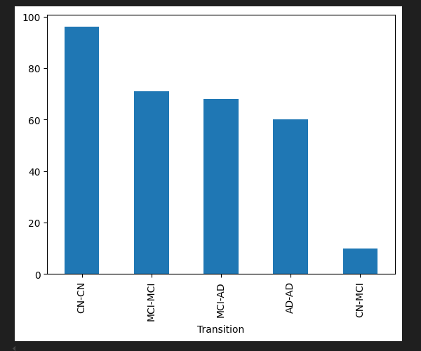
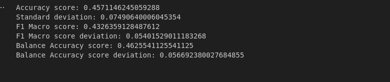
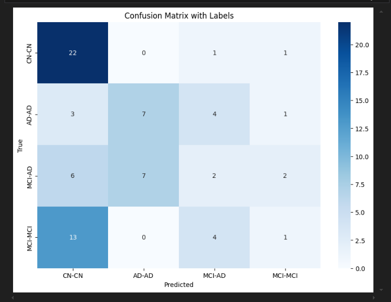
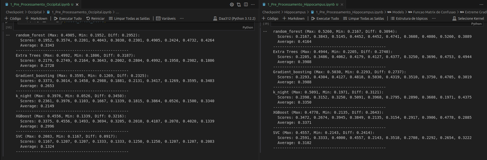
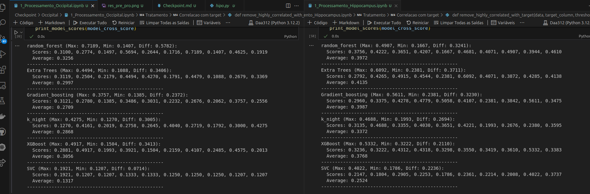

# Evolução do Trabalho (Hippocampus)

## Submits Inicial

Inicialmente realizamos a visualização e o pre processamento do dataset do hippocampus.

Como o dataset é muito extenso decidimos que a melhor forma do analisamos era através de CSV's.

Sendo que o primeiro csv que nós criamos foi o de Analise da correlação das Colunas com o Target.

Percebemos assim que o data set estava dividido por grupos:

### Grupos

| Coluna 1        | Coluna 2        | Coluna 3       |
|------------------|-----------------|----------------|
| original         | wavelet-LLH    | wavelet-HHL    |
| wavelet-LHL      | wavelet-LHH    | wavelet-HHH    |
| wavelet-HLL      | wavelet-HLH    | wavelet-LLL    |
| log-sigma-1-0    | log-sigma-2-0  | log-sigma-3-0  |
| log-sigma-4-0    | log-sigma-5-0  | square_        |
| square_          | squareroot     | logarithm      |
| exponential      | gradient       | lbp-2D         |
| lbp-3D-k         | lbp-3D-m1      | lbp-3D-m2      |

E cada SubGrupo está dividido pela aplicação da biblioteca python PyRadiomics.

| Category                                 | Description                            |
|-----------------------------------------|----------------------------------------|
| First Order Statistics                  | Extracts statistical features.         |
| Shape-based (3D)                        | Captures 3D geometric characteristics.|
| Shape-based (2D)                        | Captures 2D geometric characteristics.|
| Gray Level Co-occurrence Matrix         | Measures spatial gray-level relations.|
| Gray Level Run Length Matrix            | Analyzes runs of similar gray levels. |
| Gray Level Size Zone Matrix             | Examines zones of similar gray levels.|
| Neighbouring Gray Tone Difference Matrix| Evaluates differences between neighbors.|
| Gray Level Dependence Matrix            | Captures gray-level dependencies.     |

### Primeira Boa Submissão

Com a análise dos Grupos e SubGrupos decidimos retirar as colunas menos relacionadas com o target e os grupos menos correlacionados com o target.

Depois prosseguimos a implementar a normalização, retirar colunas com alta correlação entre si, colunas multi-valor com desvios padrões muito baixos, etc.

Percebemos que este modelo tinha muito overfiting, pois tudo o que fizemos piorava o score do modelo no Kaagle com algumas melhorias na nossa máquina. Sendo que o principal ponto que nos fez concluir o overfiting foi se mexessemos nos grupos pouco relacionados o score no Kaagle desciam sempre.

### Segundo Momento

Após retirarmos os principais motivos de overfiting do nosso modelo, decidimos implementar o SMOTE, pois havia uma grande discrepância do número de pacientes entre classes

A aplicação do **SMOTE** aumentou muito a media do nosso crossvalidation score, portanto, decidimos retirar a class CN-MCI do modelo de testes, pois uma classe que antes era quase impossível de prever passou a ter uma accuracy muito grande, decidindo assim lidar com esta class mais tarde

Isto baixou um pouco a accuracy, decidimos também de balancear melhor o **train_split_test**  com a utilização do **statify**.

### Terceiro Momento

Analisando o nosso projeto percebemos 2 pontos de falha:

- Estávamos a fazer **SMOTE** antes do **train_spit_test** levando a termos pacientes ***ficticios*** no data set de validação.

- E estávamos a fazer um ***model.fit*** antes da cross-validation, informando assim o modelo de um dos possíveis **folds**. Aumentando assim bastante o nosso **cross_score_validation.mea()**

Corrigindo este pontos, fizemos um novo modelo, onde retiramos as colunas pouco correlacionadas com o target e muito relacionadas entre si.

Fizemos **hypertuning**,com TPE, deste modelo obtendo uma accuracy de **0,52** e os seguintes resultados.

# Dataset Controlo (Occipital)

A analise do dataset de Controlo, occipital tem o objetivo de mostrar mos se o Hippocampus é de facto relevante para  a previsão do Alzeimer nos seres humanos e não apenas uma area irrelevante do cérebro.

Para isto fizemos dois testes testamos, no primeiro, o tratamento de dados foi muito básico, onde apenas removemos os dados, categóricos e single value columns

E outro onde removemos as colunas pouco relacionadas com o target e colunas muito relacionadas entre si.

Obtendo os seguintes resultados:

Analisando o os resultados obtidos nos modelos no Occipital e no Hippocampus, percebemos que os modelos com os dados do Occipital apresenta uma pior media no cross_validation, uma maior discrepância entre a melhor e a pior previsão por fold como valores mais baixos da pior previsão. 

O mesmo acontece quando retiramos as colunas com menos que 0.02 de correlacao com o target: 

